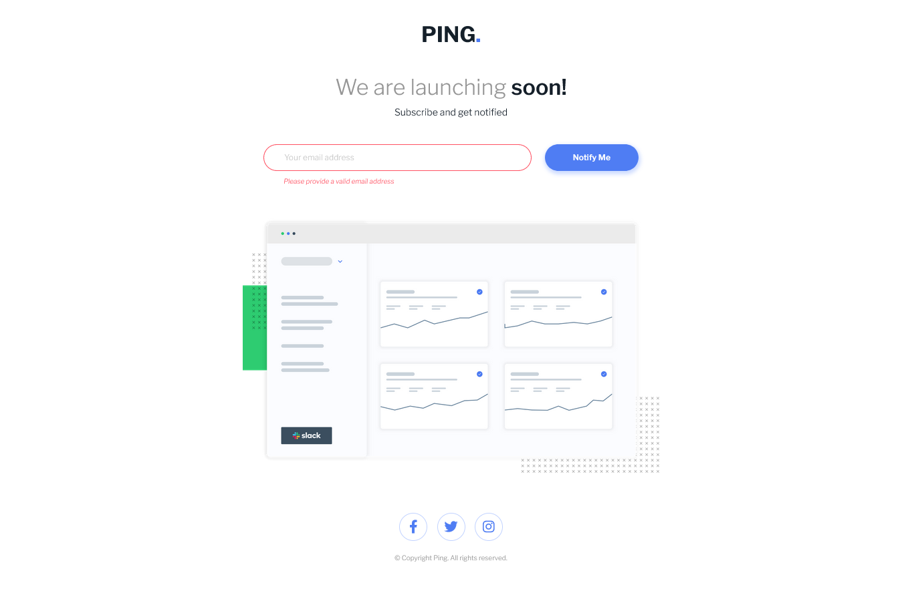

# Frontend Mentor - Ping coming soon page solution

This is a solution to the [Ping coming soon page challenge on Frontend Mentor](https://www.frontendmentor.io/challenges/ping-single-column-coming-soon-page-5cadd051fec04111f7b848da). Frontend Mentor challenges help you improve your coding skills by building realistic projects. 

## Table of contents

- [Overview](#overview)
  - [The challenge](#the-challenge)
  - [Screenshot](#screenshot)
  - [Links](#links)
- [My process](#my-process)
  - [Built with](#built-with)
  - [What I learned](#what-i-learned)
  - [Continued development](#continued-development)
  - [Useful resources](#useful-resources)
- [Author](#author)
- [Acknowledgments](#acknowledgments)


## Overview

### The challenge

Users should be able to:

- View the optimal layout for the site depending on their device's screen size
- See hover states for all interactive elements on the page
- Submit their email address using an `input` field
- Receive an error message when the `form` is submitted if:
	- The `input` field is empty. The message for this error should say *"Whoops! It looks like you forgot to add your email"*
	- The email address is not formatted correctly (i.e. a correct email address should have this structure: `name@host.tld`). The message for this error should say *"Please provide a valid email address"*

### Screenshot




### Links

- Solution URL: [Add solution URL here](https://your-solution-url.com)
- Live Site URL: [Add live site URL here](https://your-live-site-url.com)

## My process

### Built with

- Semantic HTML5 markup
- CSS custom properties
- Flexbox
- CSS Grid
- Mobile-first workflow
- [Normalize.css](https://necolas.github.io/normalize.css/)
- [Sass](https://sass-lang.com/) - CSS Prepoprocessor
- Javascript


### What I learned

It is my first time using the popular normalize.css via CDN, I have consufion on this one since I first installed it via npm, how to utilize this via npm? 

Anyway it is a great help for normalizing the user agent style of the browsers. 
```html
<link rel="stylesheet" href="https://cdn.jsdelivr.net/npm/normalize.css@8.0.1/normalize.css">

```

The styles I used to create the logo in a ellipse is this, I had a hard time centering the elements in a perfect circle and then I looked for the styles for it and got this. It worth remembering that the combination to achieve that look are line-height, width, height, padding and vertical align. 
```css
    .footer__socials {
        display: inline-block;
        text-align: center;
        color: $blue;
        line-height: 1rem;
        height: 1rem;
        width: 1rem;
        padding: .5rem;
        border-radius: 50%;
        border: 1px solid $pale-blue;
        vertical-align: middle;
```
On my JS file, I used .match function for the first time. I also utilized the regex validation for email stored in validEmail variable. It is also my first time using the arrow function
```js
else if (!(inputValue.match(validEmail))) {
        alert.innerText = 'Please provide a valid email address';
        alert.classList.remove('hero__alert--hide');
        heroInput.classList.add('hero__input--error');
}
btn.addEventListener('click', () => {
}
```


### Continued development

On my upcoming projects, I'm going to still develop Javascript projects on Frontend Mentor. 

### Useful resources

- [Perfect ellipse on an icon](https://markheath.net/post/font-awesome-circle-background) - This is source for creating the background ellipse on an icon. 
- [Get input value](https://www.delftstack.com/howto/javascript/javascript-get-input-value/) - Getting the value of an input element. 
- [Javascript Arrow Function](https://www.youtube.com/watch?v=h33Srr5J9nY) - This is an amazing article which helped me finally understand the difference with the normal function vs arrow function.

## Author

- Github - [loifloro](https://github.com/loifloro/)
- Frontend Mentor - [@loifloro](https://www.frontendmentor.io/profile/loifloro)
- Twitter - [@loisfloro](https://www.twitter.com/yourusername)

## Acknowledgments

Thank you Frontend Mentor for having projects that helps beginner to really enhance their knowledge.
